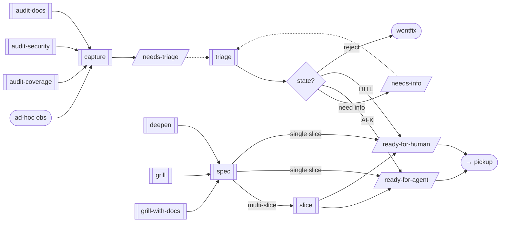
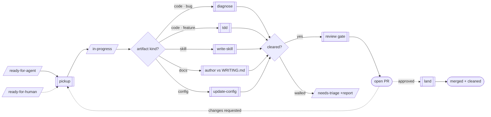

# Workflows

How the granular skills compose into one dev loop. Each hop between skills is a handover ([HANDOVER.md](HANDOVER.md)); this file is the whole-graph view — the named chains and where each can run unattended.

## The loop

The dev loop splits into two halves that meet at the **ready** states — the first human-driven (deciding *what* to build), the second the autonomous implementation loop. Flowchart symbols carry meaning: subroutine boxes (`▐ ▌`) are skills, parallelograms are tracker states (labels written to the tracker), diamonds are decisions, stadiums are start/end. **Dashed edges are human-gated** — an autonomous run halts there and a person resumes.

### Reaching a ready state



A finding enters via `capture` (from any `audit-*` finder, or an ad-hoc observation) at `needs-triage`, where `triage` — always a human — decides the state and writes the agent brief. A designed change (`deepen` / `grill` → `spec`) skips triage: for a single-slice change `spec` emits a lean ready issue directly, its body acting as the brief; for a multi-slice one it emits a PRD parent (category label only, no ready state) that `slice` cuts into ready children, each linked to the PRD as a native GitHub **sub-issue** and to its blockers as native **dependencies** (not body prose). `pickup` reads those dependencies to decide grabbability, and `land` reads the parent's sub-issues to close the PRD once its last child lands. `needs-triage` and `ready-for-human` are the two human gates.

### Implementing a ready issue



`pickup` claims a ready issue (adds `in-progress`, keeps the readiness label) so the loop won't re-grab it, routes by **artifact kind**, then — if the work clears — runs the **review gate** over the branch diff and opens a PR for a human to merge (the open PR *is* the review state — there's no review-state label). If a human requests changes on the PR, it re-enters `pickup` for another round on the same branch. If it walls, it returns the issue to `needs-triage` with an attempt report — the failure circuit-breaker back at the first diagram's human gate. Once a human approves the PR, `land` executes the merge and clears the trail — strips `in-progress`, deletes the branch and any worktree; it is human-invoked and never runs from `auto`, so the final merge stays a human act.

Category (`bug`/`enhancement`) only forks the **code** routes; artifact kind is the orthogonal axis the implementer hangs off. `tdd` and `diagnose` are *code* loops — red-green and reproduce-fix — so non-code work routes elsewhere: a **skill** to `write-skill`, **docs/prose** (CONTEXT.md, ADRs, READMEs) to direct authoring against [../WRITING.md](../WRITING.md), **config/harness** (settings.json, hooks, keybindings) to `update-config` / `keybindings-help`. `pickup` infers the kind from what the brief targets.

What TDD contributes to the loop isn't the red test — it's *a gate that can fail before merge*. That generalises across kinds, so the **review gate adapts**:

- **code** — `/code-review` (bugs + cleanups) plus `/security-review`. `simplify` is deliberately not in the gate — `/code-review` subsumes its cleanup-only scope.
- **skill / docs** — a writing-rubric review against [../WRITING.md](../WRITING.md) plus a structure/accuracy check (`write-skill`'s own rubric for a skill). `/code-review` and `/security-review` don't apply to prose.
- **config** — `verify`: does the setting take effect / the hook actually fire.

The gate is **mandatory in an autonomous run** and offered as a **choice when driven manually**. The invariant holds for every kind: `branch → gate → PR → human merge`. The leading `branch` is non-negotiable — work never lands on the default branch; see [../ISOLATION.md](../ISOLATION.md) for branch-first, naming, and when concurrent/AFK work isolates in a worktree instead.

## Named workflows

| workflow | chain | enters from | autonomous? |
|---|---|---|---|
| **findings** | `audit-*` → `capture` → *needs-triage* | an audit | yes — runs to `needs-triage`, stops |
| **design** | `deepen` / `grill` / `grill-with-docs` → `spec` → `slice` (multi-slice) or `pickup` (single slice) | a conversation | no — grilling/seams/granularity need the user |
| **fix** | `diagnose` → review gate → PR | a bug report | loop runs AFK; the fix is staged on a branch |
| **implement** | `pickup` → `tdd` / `diagnose` / `write-skill` / docs / config → review gate → PR → *(human approves)* `land` | a ready issue | AFK issues yes to the PR; `land` is human-invoked |

Run a workflow **interactively** by invoking its head skill — `/audit-coverage` (findings), `/diagnose` (fix), `/pickup` (implement), `/deepen` etc. (design). Each skill ends by rendering its `## Handover` row as an `AskUserQuestion`; taking the recommended hop at each prompt walks the same chain, every gate confirmed by you and the human gates (`triage`, grilling loops) running in place.

Run it **head-down** with `/auto <start>` (e.g. `/auto findings`); schedule it with `/schedule` or `/loop`. `auto` walks the default chain, taking each handover's recommended hop silently, and halts at the first gate it can't clear.

## HITL / AFK is the autonomy axis

The same distinction runs through the whole system, under different names at each layer:

- **Skills** declare `advance` / `stage` / `never` ([HANDOVER.md](HANDOVER.md)).
- **Work items** carry `ready-for-agent` (AFK) / `ready-for-human` (HITL).
- **`slice`** marks each slice AFK/HITL, which becomes its label.

They're one axis: *can this proceed without a human?* `pickup`'s autonomy is therefore **conditional on the issue's label** — it runs `ready-for-agent` unattended and stops at `ready-for-human`. The readiness label persists through `in-progress` (claiming adds `in-progress`, it doesn't replace the label), so a rework round — a PR a human sent back with changes requested — reads the same autonomy: AFK PRs resume unattended, HITL PRs wait for the human.

## Two autonomy boundaries

An autonomous run accretes reviewable artifacts and stops at the human gate — it never pushes through one. There are exactly two such gates:

1. **Produce side — `needs-triage`.** `capture` files here; `triage` (the human) promotes. `/auto findings` halts here.
2. **Implement side — `ready-for-human`.** `pickup` clears `ready-for-agent` itself; an HITL issue stops for a person.

So the fully autonomous loop is the right-hand side, and it **self-heals review feedback** — a human requesting changes on a PR feeds the next `auto` tick, which resumes that AFK branch before grabbing new work:

```
schedule ─► auto ─► pickup(rework first, else next ready-for-agent) ─► tdd / diagnose ─► review gate (code + security) ─► PR ─► human review
                          ▲                                                                                                    │
                          └───────────────────────────── changes requested (AFK only) ──────────────────────────────────────┘
```

Everything left of `ready-for-agent` (deciding *what* to build), each human PR review, and the final merge stay human. Everything between can run AFK — including addressing review comments, since the human's "request changes" *is* the gate that authorises the next round.

## Context & delegation

The window is a budget: keep a working session under ~100k tokens, never past ~200k. The bloat is never a skill's *output* — every handover artifact is already compact (findings, a PRD, issues, a PR). The *interior work* — broad reads, test/log output, debug iteration — rots the window. So: **the handover artifact is the context boundary; push the interior across it into a subagent.** The main session stays a thread of artifacts + decisions.

Visibility and delegation pull against each other, and the need for each is inverted — you watch when you're driving one skill; the window balloons when nobody's watching a long unattended run. Delegate where visibility is already zero; use hygiene (not delegation) where you're watching:

- **Interactive, one skill** — stay in the main session. Bound the window with hygiene: run noisy feedback loops (`diagnose` Phase 1, `tdd` test runs) in the background and pull only the signal; reserve subagents for mechanical sub-tasks (a `git bisect run`, a fuzz loop) that return a one-line verdict.
- **`auto` (unattended chain)** — no rule of its own; `auto` inherits each skill's delegation profile above. Cheap hops (findings in → issues out) run inline even unattended; only heavy interiors (a large-tree audit, a `tdd`/`diagnose` loop) delegate. The one difference from interactive: nobody's watching, so when a hop *does* isolate it's a subagent rather than a backgrounded-for-signal job. Visibility never justified delegation — window hygiene does — so `auto` isolates exactly the hops a watched run would, no more, and the window stays within target by construction.
- **Audits (`audit-*` / `deepen`)** — fan out `Explore` subagents only when scope is large (> ~25 files), one per area, each returning structured candidates; the main session does the cull (the judgment step, and small). At or below the threshold, explore inline — the reads fit and stay visible.
- **`pickup` (implement loop)** — hybrid. Orchestration, brief, and routing stay in the main session. Delegate the heavy children: the review gate as two parallel subagents (`/code-review` + `/security-review`), `verify`, and — on the AFK path only — the whole `tdd`/`diagnose` implementation. On HITL keep implementation inline (you're driving) and just background its noisy output.

## Not in a workflow

`handoff`, `caveman`, `zoom-out`, `verify`, `simplify` are standalone — tools used across the loop, not producers in a chain. They have no handover declaration. (`code-review` and `security-review` are also standalone commands, but the implement loop invokes them as its review gate — see above. `write-skill` and `update-config` are likewise standalone, but the implement loop invokes them as its non-code implementers — see the route above. `field` — the dual of `grill`, which answers questions put *to* the agent and converges with the user — is standalone too, but `pickup` invokes it on the **rework** path when a PR review carries questions rather than change requests; like `grill` it is `auto: never`, so a question on a review forces that rework round onto the human path.)
